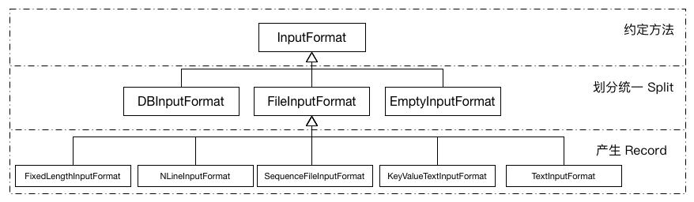
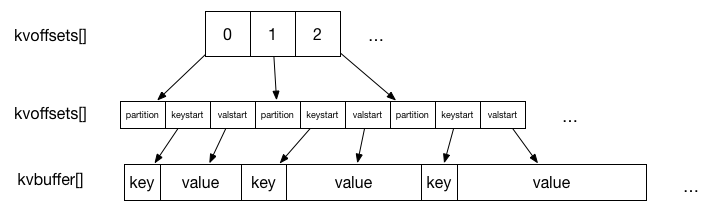
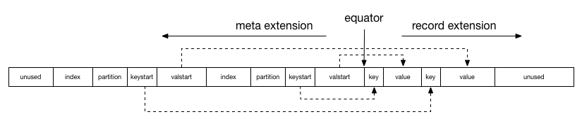

- TOC
{:toc}

对于一个简单的 MapReduce 作业，用户只需要实现 Map 与 Reduce 两个函数。
这两个函数由继承 Mapper 与 Reducer 类并重写相关方法得来，
在 Hadoop2.7.3 源码中可以看到，`hadoop-mapreduce-project` module 中的示例程序 `WordCount`。
其中包含两个静态内部类: TokenizerMapper和IntSumReducer。
分别继承自 Mapper 和 Reducer，并重写了对应的 map 和 reduce 方法。在 Hadoop 中会通过反射将这两个类分别注入到 MapTask 和 ReduceTask 中进行调度运行。
其中 MapTask 可以细分为Read, Map, Collect, Spill 和 Combine 五个阶段；ReduceTask 可以细分为 Shuffle, Merge, Sort, Reduce 和 Write 五个阶段。

-------------------------------------------------------------------------------

# Task 运行概述
 总体来说，MapReduce 过程分为 Map 阶段以及 Reduce 阶段。
 其中每个 Map Task 处理一篇数据（InputSplit，属逻辑分片），而 Reduce Task 从每个 Map Task 的输出中拷贝相应数据，经处理后写入 HDFS 中作为最终结果。
 总体上来看，整个过程采用了 pull 模型。也就是说，Map Task 将中间结果保存到本地磁盘中，再由 Reduce Task 从 Map Task 端拷贝拉取(pull)数据进行后续处理。
 这两者之间通过 HTTP 协议传输数据。

## Map Task 流程:
 1. 根据用户指定、编写的 InputFormat 将Split 解析成为  键值对(k1,v1) 的形式
 2. 上述(k1,v1) 输入 map 函数，得到(k2,v2)
 3. 根据指定的 Partitioner(默认为 Hash Partitioner) 进行数据分片, 以确定每个键值对应该由哪个 Reduce Task 处理
 4. 将经过之前处理后的数据通过用户定义的 Combiner(可选项) 进行本地规约
 5. 将处理后的结果保存至本地硬盘上

## Reduce Task 流程:
 1. 通过 HTTP 协议从各个已完成的 Map Task 中拷贝相应的数据
 2. 数据拷贝完成后根据 key 值进行排序，将 key 相等的记录聚集到一起形成若干分组
 3. 将每组数据输入 reduce  函数中
 4. 将 reduce 的输出写入 HDFS

# Task 抽象类分析
Task 作为一个抽象类，是 MapTask 和 ReduceTask 的父类。
其中若干内部类作为 Task 运行流程中的工具类：
## Task 内部类介绍
+ **~~Counter~~**: 统计 Task 内部各类数据，目前已废弃，使用单独的枚举类`TaskCounter` 实现。
+ **TaskReporter**: 继承自 `StatusReporter` 并实现`Reporter`和`Runnable`接口。作为一个独立的线程报告任务的进度、状态以及更新计数器。 若长期未收到该线程的报告，则视为该任务失效，杀死并重新调度。
+ **GcTimeUpdater**: 记录并更新该任务在 GC 中所消耗的时间
+ **FileSystemStatisticUpdater**: Hadoop 提供一个 `FileSystem` 抽象类，为了保证不同文件系统之间的通用性。其中包含内部类`Statistics`，该类中包含用 *volatile* 关键字标注的统计用变量。
  `FileSystemStatisticUpdater` 在其中迭代上述变量并记录最新状态，并创建各变量对应的 Counter。
+ **ValuesIterator**: 以排序后的 `RawKeyValueIterator` 为输入，以迭代value 为目的的键值对迭代器。
+ **CombineValuesIterator**: 继承自`ValuesIterator`， 仅在重写 *next()*方法时添加了 combine 计数器。
+ **CombineRunner**: 以抽象类的形式对 combinerRunner 的两种API进行一次封装， 实现*create()*方法并在其中实例化 `OldCombineRunner`或`NewCombineRunner`。 规定*combine()*接口，以空方法表示，要求子类重写。
+ **OldCombineRunner**: 实现了*combine()*方法的子类，通过反射实例化 Reducer ，迭代`CombineValuesIterator` 将具有相同 key 值的键值对进行 reduce 操作。
+ **NewCombineRunner**: 为使用新的 API 实现一个内部类 `OutputConverter<K,V>` 并创建 `ReduceContext` 作为参数传入 Reducer 的 run 方法中。 新 API 封装性更好，将迭代过程封装到 `Reducer` 内部， 通过`ReduceContext` 设置参数。

## Task 方法介绍
Task 作为一个抽象类，提供了许多 get/set 方法。包括各类秘钥（JobTokenSecret, ShffleSecret, EntryptedSpillKey)，流程控制方法(partition, phase, FsStatistics, progress, status), 任务相关标示(taskID, isJobSetupTask, isMapOrReduce)。
### 接口
作为一个 Task 最重要的 *run* 方法， 规定了一个接口，由 `MapTask` 和 `ReduceTask` 分别各自实现。
```java
  public abstract void run(JobConf job, TaskUmbilicalProtocol umbilical)
    throws IOException, ClassNotFoundException, InterruptedException;
```
其第一个参数`JobConf`是作业从 Client 创建时指定的内容， 第二个参数 `TaskUmbilicalProtocol` 是 Hadoop 所有子进程与其父进程通信的协议接口。
父进程指一个守护进程，它与 Master 进行通信，要求创建 Map 或 Reduce 任务并作为子进程运行。

### 任务准备
`Task` 的 *initilize* 方法进行任务初始化。
首先，根据`JobConf`创建 *`JobContextImpl`:jobContext* 和 *`TaskAttemptContextImpl`:taskContext*，并将任务状态由*UNSSIGNED*修改为*RUNNING*。
若使用 new API， 需要通过反射获得 *outputFormat*，从 OutputFormat 中获取*`OutputCommitter`:committer*，否则直接从`JobConf`中取得*committer*。
然后指定输出目录，调用*comitter.setupTask()*完成任务创建。
最后使用到`ResourceCalculatorProcessTree`进行一些资源管理方面的处理。
### 读写
*readFiles(DataInput in)* 和 *write(DataOutput out)* 分别负责从（向）I/O 流中读取（写入）数据。 此外还需判断当前热舞是否为 Job clean up 或 Task clean up 任务并进行相关操作。

# Map Task 内部实现
## run 方法
`MapTask`在*run()*进行 task 相关设置

1. 根据是否包含 Reduce 任务设置进度百分比：
   1. Reduce 任务数量等于0，task 只有 map 阶段，完成时进度显示为100%(1.0f)
   2. Reduce 任务数量大于0， task 分为 map 和 sort 两个阶段，前者完成时进度为66.7%(0.667f)，后者即为剩下的33.3%(0.333f)
2. 调用 *`jobConf`:getUseNewMapper()* 判断使用的 API类型并传入父类的 *initilize()*方法进行初始化
3. 并判断任务是否为 setup 或 cleanup 操作完成, 若是则执行相关方法并返回，否则进行常规的 map 任务
4. 具体的 Map 操作由 *runNewMapper()* 和 *runOldMapper()*实现。
5. map 操作完成后，调用 *done()* 方法进行收尾工作。

## runOldMapper 方法
对于一个 Map 任务，首先要找到与之对应的 `Split` 这里涉及到三个方法

```java
    InputSplit inputSplit = getSplitDetails(new Path(splitIndex.getSplitLocation()),
           splitIndex.getStartOffset());
    updateJobWithSplit(job, inputSplit);
    reporter.setInputSplit(inputSplit);
```

注意到`InputSplit` 在这里（*runOldMapper*）是一个接口，而与之同名的抽象类用于新的 API（*runNewMapper()*) 中。
`FileSplit` 通过实现`InputSplitWithLocationInfo`(子接口)并继承`InputSplit`以达到在新旧 API 中能够通用的目的。
`InputSplit`表示每个task 需要处理的数据， 一般来说以面向字节的方式呈现，而 `RecordReader` 负责以面向记录(record-oriented) 的方式呈现数据。
另外一个需要指出的是变量*splitIndex*，它是类`JobSplit`的一个内部静态类`TaskSplitIndex`的实例， 用于指定该任务待处理数据在文件中的偏移量。
之后通过两个方法将 inputSplit 的详细内容更新到 Job 和 reporter 中。 需要了解 Split 的详细内容请点击[这里](#inputformat)。

接下来，会判断 skipping mode 实例化 SkippingRecordReader 或 TrackedRecordReader。 在 Map Task 中，读取 Record 出现错误时该 Record 会被标记，
如果多次出现问题，将会进入 skipping mode，跳过所有被标记的 Record。
之后根据 Reduce Task 的数量实例化 MapOutputCollector：
对于不存在 Reduce Task 的作业，将实例化`DirectMapOutputCollector`，把结果直接输出。
而正常存在 Reduce Task 的作业，将调用*createSortingCollector()* 从 `JobContext` 中读取 Collectors 列表并迭代选择合适的 Collector 进行初始化。
然后通过`MapRunnable`接口创建 *runner*，该接口是为了扩展 Map 通用性，使其在多线程或或异步 mapper 中更具可操作性。调用*runner.run()*之后 map 阶段完成，
对于存在 Reduce task 的作业，进入 sort 阶段。 最后更新状态进行资源的释放，本方法结束。

另外值得一提的是 MapOutPutBuffer 中存在一个默认 Collector : `MapOutPutBuffer` 该类是 MapTask 的一个内部类， 涉及到 **Spill**操作和缓冲区设计的细节，
需要了解请点击[这里](#spill)。

# Reduce Task 内部实现
## run 方法
与 Map 类似，判断是否为正常的 MapReduce 任务（即非 setup 或 cleanup 任务）。是则通过`Progress`类添加三个阶段，分别为 copy, sort和 reduce，否则进行相关特殊任务的操作。
与 Map 不同的是，这里用到接口`ShuffleConsumerPlugin`，Hadoop 提供它的一个实现类`Shuffle`。 copy 和 sort 两个阶段均在 *`Shuffle`:run()* 中完成。该方法返回值为一个迭代器类`RawKeyValueIterator`。关于 shuffle 的详细介绍请点击[这里](#shuffle)
在清理 shuffle 相关数据结构以及标记sort 阶段结束之后，进入reduce 阶段，根据 *useNewApi* 选择调用 *runNewReducer()* 或 *runOldReducer()* 进行 reduce操作，其中 reduce 需要对键值对进行分组，用到`RawComparator`类。
最后关闭释放资源标记任务结束。

## runOldReducer方法
首先仍然是通过反射从 `JobConf`  中获取到 `Reducer`。 键值对的输出使用到`RecordWriter`, 在旧 API 中实例化的是 *`OldTrackingRecordWriter`:out*, 并为保证数据不变形用*final*修饰变量*finalOut*，其值为*out*。
之后创建一个`OutputCollector`的实例，重写其*collect*方法。在该方法中使用*finalOut*输出数据并用*reporter*更新任务进度。
与 Map 相似，Reduce 中也存在 Skip Mode，Hadoop 会根据*isSkipping()*实例化一种 `ReduceValuesIterator`。 之后会逐 Key 循环进行 reduce 操作。若处于 Skip Mode 还会更新坏记录的数量。
同样在最后进行清理工作与资源能释放。

# MapReduce 的数据传递
Hadoop MapReduce 中涉及以下数据存储单位：

+ **block**: HDFS 文件存储的基本单位，在 HDFS 中所有文件都以 block 进行存储，一式三份以保证容错能力。
+ **split**: map 任务的输入，是一种逻辑划分，map task 和 split 是一对一关系。
+ **record**: map 和 reduce 函数处理的目标， 是一个键值对。
+ **spill**: map 函数的输出超出缓冲区大小时写入本地磁盘的文件。

## InputFormat
`InputFormat` 是一个接口，规定了两个方法，有如下功能：
+ 验证作业输入是否符合标准
+ 将给定的输入文件（可能是多个)按照给定规则划分为多个部分（Split）作为Map Task的输入
+ 提供将 Spilt 转化为 map 函数能处理的键值对形式的一种实现

``` java
public interface InputFormat<K, V> {
  InputSplit[] getSplits(JobConf job, int numSplits) throws IOException;
  RecordReader<K, V> getRecordReader(InputSplit split,
                                     JobConf job,
                                     Reporter reporter) throws IOException;
}
```

*getSplits()*会根据作业信息以及 Hadoop 配置产生出一组 Split。
要注意，这些 Split 作为逻辑分区并不真实存在于每个 Map 节点上（从其实现类的源码中可以看出）。
每个 Split 可由一个三元组*(input-file-path, start, offset)*表示(此处存疑，但源码中 getSplit 方法的注释如此描述)。
*getRecordReader()* 则由不同的实现类负责划分 record 的界限，为 map 操作做好准备。

InputFormat的设计通过多级划分，充分考虑了复用性和差异性。其类间关系如下图所示：


接口`InputFormat`最主要的实现是`FileInputFormat`而他本身也只是一个抽象类。其中涉及到大量文件操作的方法，包括多文件操作的过滤器，递归访问，路径设置等。
其中最重要的就是实现了*getSplits()*方法，其中涉及到 Split 分割的算法。
Split 大小由如下公式计算得来
$$splitSize = \max(minSize, \min(goalSize,blockSize))$$
其中目标大小: $$goalSize = totalSize / numSplits (numSplits \geq 1)$$, minSize由配置文件指定，默认为1。
也就是说通常情况下, Split 的大小与 blockSize 的默认大小（64M)相等。 若想增大 Split 的大小，从配置文件中增大 minSize 即可。
这里给出 三个文件，大小分别为(1MB, 32MB 和 250MB)各 size 取不同值对应的 Split 数目[^1]:

| minsize   | goalSize                 | splitSize   |    file3 split 数目 |    split 总数目 |
| :-------: | :----------------------: | :---------: | :-----------------: | :-------------: |
| 1 MB      | totalSize(numSplits=1)   | 64MB        |                   4 |               6 |
| 32 MB     | totalSize/5              | 50MB        |                   5 |               7 |
| 128MB     | totalSize/2              | 128MB       |                   2 |               4 |

在进行逻辑上的 Split 划分之后，需要确定该 Split 的物理位置。因为 HDFS 中文件以 Block 形式存储且一式三份，也就意味着对于一个 Split，与之对应的 block 会有多个。*getSplitHosts()*方法接收网络拓扑和 Split 信息做为参数，将返回一组对当前 split 贡献度最大的 hosts(节点)，一般来说，考虑到数据本地性，同一Rack 的节点贡献度要高于跨 rack 节点。

InputFormat 的最后一项任务就是 *getRecordReader()*, 该方法因输入文件类型以及程序目的的不同又各子类进行实现。`RecordReader` 在实现时需要注意两点，第一：记录需要被分解为 Key, value 两部分，因为 map 函数只能接受键值对形式的输入。 第二：记录可能因 Split 的划分被分割成两部分，RecordReader 规定每个 Split 的第一条不完整 Record 为上一个 Split 所有。
## OutputFormat
接口`OutputFormat` 中规定两个方法，其一是*getRecordWriter()*，获取用于写输出文件的 RecordWriter， 同样根据场景子类进行实现。
另一个方法为*checkOutputSpecs()*在抽象类`FileOutputFormat`中有实现，用于验证 Job 指定的输出的正确性，出现问题时抛出异常由上层进行处理。
`RecordWriter` 在 `ReduceTask` 或 `DirectMapOutputCollector`(没有 reduce 任务的作业)中用到，将数据通过输出流一步步写出。

## spill
spill 产生于 map 之后，也就是 collect 方法中。经过 map 计算后的中间结果会经由 partitioner 按 key 分成若干组（组数等于 reduce task 的个数），这时(k,v)会变成(k,v,partition)组成的三元组，传递给 *`MapOutputBuffer`.collect()* 做进一步处理。
在`MapOutputBuffer`中使用一个缓存区收集中间结果，在使用率到达一定阈值后排序并进行一次flush操作。这个过程由 *`MapOutputBuffer`.sortAndSpill()* 方法完成，每一个 spill 都是内部有序的，而且如果存在 combiner，在 spill 之前会执行 combine 操作进行数据压缩。
中间结果的产生和写入磁盘可以看成生产者-消费者模型，*collect()*方法是生产者，而*write()*为消费者。二者通过可重入互斥锁 *`ReentrantLock`:spillLock* 同步。
类`SpillThread`继承Thread 实现 *run()* 方法
```java
      @Override
      public void run() {
        spillLock.lock();
        spillThreadRunning = true;
        try {
          while (true) {
            spillDone.signal();
            while (!spillInProgress) {
              spillReady.await();
            }
            try {
              spillLock.unlock();
              sortAndSpill();
            } catch (Throwable t) {
              sortSpillException = t;
            } finally {
              spillLock.lock();
              if (bufend < bufstart) {
                bufvoid = kvbuffer.length;
              }
              kvstart = kvend;
              bufstart = bufend;
              spillInProgress = false;
            }
          }
        } catch (InterruptedException e) {
          Thread.currentThread().interrupt();
        } finally {
          spillLock.unlock();
          spillThreadRunning = false;
        }
      }
```
从源码中可以看出，配合*spillLock*控制同步信号的还有两个`Condition`:*spillDone* 和 *spillReady* 以及两个`boolean`:*spillInProgress* 和 *volatile spillThreadRunning*。
该线程在 *`MapOutputBuffer`.init()* 方法中被启动进入等待状态，每当collect执行的时候，都需要判断缓冲区是否达到阈值且 spill 线程是否正在运行，然后执行相关操作。
另外源码中还设计两组标志位(kvstart,kvend)和(bufstart,bufend)，分别对应索引和缓冲区(详见下节)，每次 spill 都会将 start 和 end 之间的内容写入磁盘。

###  缓冲区与索引
为保证读写操作的并行性，Hadoop 在这里设计了一种环形缓冲区。
如果采取读写公用的单向缓冲区，锁将使得读写操作中总有一个处于等待状态。另外一种做法是设置两个缓冲区，交替读写，这一定程度上缓解了并行问题，但还是会存在等待问题。所以 Hadoop 选择了环形缓冲区，不断向剩余空间内循环的写入数据。
另外，Hadoop 考虑到效率问题，设计了二级索引结构。所以如上的环形缓冲区共有三个，分别为 kvoffsets, kvindices 和 kvbuffer，共占用空间为 io.sort.mb(默认值100MB)。其关系如下图所示[^1]：



+ kvoffsets: 偏移量索引数组，保存 key,value 的位置索引在 kvindices 中的偏移量
+ kvindices: 位置索引数组，保存 key,value 在 kvbuffer 中的起始位置
+ kvbuffer: 数据缓冲区，保存实际的 key,value 值

因为缓冲区共享100MB 内存，一个合理的比例成为一个问题。在 Hadoop 0.21中，为避免设置比例的不合理带来的性能问题，将这三个缓冲区进行了合并。通过一个指针 equator 标明索引和数据共同的起始位置，索引和数据分别沿相反方向增长使用内存空间，如下图所示[^1]：



## shuffle
shuffle 过程是将 map task 的最终结果拷贝到 reduce task 所在的节点上的过程，在拷贝数据量达到一定阈值后出发合并线程对本地数据进行合并操作为 reduce 的运行做准备。
在`ReduceTask`我们提到接口`ShuffleConsumerPlugin`规定了 shuffle 过程中必要的方法，Hadoop 给出了他的一个实现类`Shuffle`。

`Shuffle`类中最重要的方法*run()*返回一个`RawKeyValueIterator`，由后续操作再次封装后作为 reduce 操作的对象。
在*run()*方法中，首先实例化一个`EventFetcher`来处理 map-completion 事件，然后根据配置实例化若干 `Fetcher`并启动线程，对于 map 结果在本地磁盘中的任务，会实例化`LocalFetcher`。
最后不断通过`Reporter`输出进度，直到 *`ShuffleScheduler`waitUntilDone()* 判定 shuffle 完成，copy 阶段结束。

具体 copy 的步骤在`Fetcher`类中实现，*copyFromHost()* 从指定`MapHost`中 shuffle 可用的 map 结果，将该 Host 中的可用结果拼接返回一个 URL并打开输入流。
之后开始执行 *copyMapOutput()* 函数拷贝数据。 对于拷贝失败或没有响应的任务，通过异常做重新调度等处理。*copyMapOutput()* 方法将通过各种工具类实施 copy 过程，并进行 merge 操作。


[^1]: 参考自《Hadoop 技术内幕：深入解析 MapReduce架构设计与实现原理》 董西成 著
<script src="https://cdn.mathjax.org/mathjax/latest/MathJax.js?config=TeX-AMS-MML_HTMLorMML" type="text/javascript"></script>
