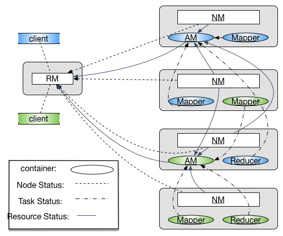
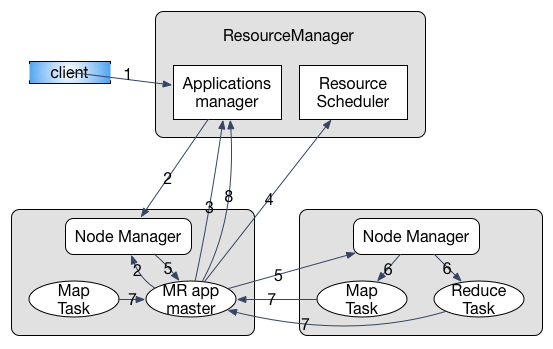

- TOC
{:toc}

# MR v1 与 MR v2
MapReduce 框架在大规模数据集中的优良表现使其得到广泛应用，然而随着数据量的增长以及新应用类型的出现，最初的 MapReduce 框架(MR v1)面临诸多瓶颈。所以，Apache 又提出了 MR v2 以解决最初的 MapReduce 遇到的问题。
两者的主要区别有如下几点：

+ 扩展性：在 MR v1 中，资源管理和作业控制在同一个组件中管理。当数据量过大时，该组件的能力成为扩展集群规模的瓶颈。而 MR v2 将资源管理和作业控制分别作为两个可通信的独立组件，这使得瓶颈节点的压力得到了分散，提高了可扩展性。
+ 可靠性：MR v1 采用传统的 Master/Slave 架构，这时的 Master 存在单点故障问题，一旦 Master 节点失效，所有作业都将无法运行。MR v2 则将作业的 master 独立于资源分配，在 master 失效后可进行重新调度作业而不影响整个平台。
+ 资源利用率：MR v1 中资源分配的最小单位为 slot，是一种相对粗粒度的分配方案。因为一个任务很可能不能完全利用一个 slot 中的所有资源而造成浪费，此外 Map 和 Reduce 任务的 slot 不能共享，也就意味着会有闲置资源的等待问题。
在 MR V2 中有专门的资源管理器，结合管理员配置以及程序需求创建 container（一组资源的结合）运行任务。
+ 程序类型：MR v1的资源管理以及任务调度专为 MapReduce 这种离线数据处理应用制作，而后来兴起的内存计算，流式数据处理等计算需要一个更普适性的平台。

# Apache YARN
YARN(Yet Another Resource Negotiator)是一种资源统一管理平台，与其类似的还有Facebook 的 Corona 和 Berkeley 的 Mesos。 由于计算框架类型的不同，使用这种资源统一管理平台才能将多种计算框架部署于同一个集群上，能更有效的利用资源以及降低运维成本。
## YARN 组成结构
YARN 在资源管理上仍是 Master/Slave 架构，其中 Master 为 ResourceManager Slave 为 NodeManager。而对于应用的调度，则需要指定 ApplicationMaster 负责向 ResourceManager 申请资源，与 NodeManager 进行通信以获取信息进行任务调度。
要注意在 YARN 作为资源管理平台的视野中，ApplicationMaster 和其他的 Task 的地位是相似的，都运行在 Container中。其间关系如图所示：

1. **Container**: 资源分配的单位，封装了多种所需资源。task 与 container 是一对一的关系，由应用程序需求动态生成。
2. **`ResourceManager`(RM)**: 全局资源管理，负责系统资源分配。可通过 Zookeeper 来解决单点失效的问题。其中包括两个组件
   1. 调度器：根据各种限制条件将系统中的资源分配给应用程序。因为它仅负责资源分配，YARN 中将其设计为松耦合组件，提供几种实现方式，也可以由用户根据需求进行重新设计。
   2. 应用程序管理器：管理系统中所有应用，负责启动、监控 AM 并在失败时重启。
3. **`NodeManager`(NM)**：运行在每个物理节点上的资源和任务管理器，主要负责两部分工作
   1. 定时向 RM 汇报本节点资源使用情况以及 container 运行状态
   2. 接收并处理来自 AM 的任务操作请求
4. **`ApplicationMaster`(AM)**: 用户提交的应用程序需要制定 AM，YARN 内置两个 AM 的实现，其一是一个 demo 以 shell script 的形式给出，其二是 MapReduce 程序的 AM —— MRAppMaster。AM 主要负责以下三个功能
   1. 与 RM 调度器通信获取资源
   2. 与 NM 通信控制任务进程
   3. 监控调度属于他的所有任务，在失败时进行重新调度

## YARN 通信协议
各组件之间通过 RPC 通信。为保证兼容性，YARN 采用 Google 的 Protocol Buffers，在编译源代码过程中可能由于 protobuf 版本问题导致编译不通过。
在 YARN 中的通信总体上采用 pull 模型，也就是 client 主动向 server 发起连接请求。在 Hadoop 中有以下几种协议负责不同组件间的通信：

+ **ClientRMProtocol**: JobClient 与 RM 之间的通信，用于提交应用程序、查询程序状态
+ **RMAdminProtocol**: 系统管理员通过该协议更新系统配置文件
+ **AMRMProtocol**：每个 AM 通过该协议向 RM 注册并为各个 task 申请资源
+ **ContainerManager**： AM 通过该协议控制 NM 启动停止 container，以及获取各个 container 的状态信息
+ **ResourceTracker**：NM 通过该协议向 RM 注册并定时发送心跳信息汇报节点资源使用情况以及 container 的运行信息。

## YARN 工作流程
当JobClient 提交应用程序到 YARN 时，首先启动对应的 AM，然后由 AM 创建应用、申请资源、监控只到作业完成，如下图具体包含以下几个步骤[^1]：

1. 用户提交程序
2. RM 分配 Container，与 对应 NM 通信告知启动 AM
3. AM 向 RM 注册，程序进入运行状态，重复执行4-7直至结束
4. AM 采用轮询方式向 RM 申请领取资源
5. AM 申请到资源后与 NM 通信告知其启动任务
6. NM 设置好运行环境，通过脚本启动任务
7. 各任务向 AM 汇报进度
8. 完成后 AM 向 RM 发起注销请求，关闭自己

## YARN 编程模型
在 YARN 中以采用事件驱动的有限状态机进行运行控制，在 MR v1 中控制 Job 以及 Task 的 Progress 类将由用状态机重写的类替代。
对于一个生命周期较长的对象，其状态都会由一个状态机来表示。同时设计事件监听器(EventListener)和事件派发器(EventDispatcher)。
事件和状态机的变迁相互影响，也就是说监听到某事件可能会导致状态机的变迁，而状态机变迁时的行为有可能是产生一个新的事件。
所有的事件都将经过AsyncDispatcher 进行排队分发，这种事件集中排队分发的设计方式与Kafka[^2]类似。

此外，考虑到耦合性问题，YARN 中的组件以服务化的形式出现，均实现 `Service` 接口。`AbstractService`是一个抽象类，提供了一个 Service 最基本的实现。
对于非组合服务，可以直接继承`AbstarctService`类，而对于组合服务，比如`MRAppMaster`组合了各种服务对象，则需要继承`CompositeService`。

# MRAppMaster 分析
`MRAppMaster`继承`CompositeService`，是 MapReduce 型应用程序的 ApplicationMaster。
该类的 Java Doc 中介绍到，应用程序所用到的状态机被封装到接口`Job`的实现类中，所有状态的改变都要通过`Job`接口。事件（event）会导致该有限状态机的变迁。
该类本分是一个松耦合的服务组件，和其他组件的交互行为都是通过事件产生的，这种方式与参与者模式(Actor Model)很类似。
所有的组件都会向一个中心分发器（dispatcher)注册，事件均由该分发器调度分发。而各组件之间的信息会通过`AppContext`进行共享。

在`MRAppMaster`源码中有一个内部类 `RunningAppContext`实现`AppContext`接口，通过*context*可以创建 Job, Task, TaskAttempt 以及 Speculative 的事件分发器。
这个类中的代码多为环境搭建的操作，比如各服务组件的组合，监听器和分发器的创建注册，用户的验证等。
在*serviceStart()*方法的最后调用*startJobs()*创建一个job-start事件并发送至`AsyncDispatcher`，以此触发整个 Job 的状态机。

-------------------------------------------------------------------------------
[^1]: 参考自《Hadoop 技术内幕：深入解析 MapReduce架构设计与实现原理》 董西成 著
[^2]: https://kafka.apache.org
