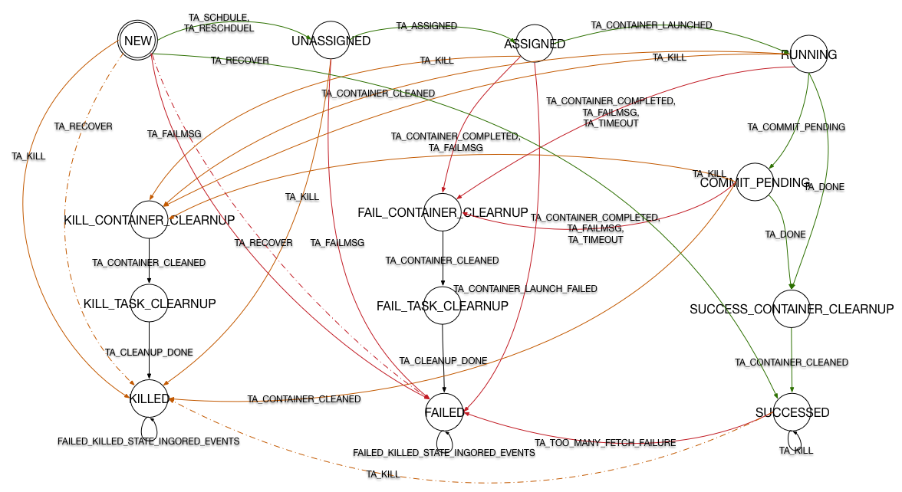

- TOC
{:toc}

# Hadoop MapReduce 状态机类结构
之前的文章[YARN 流程分析](http://frankweapon.github.io/YARN流程分析/)中提到 MR v2 之后对流程的控制都以 Actor Model 的形式进行([Actor Model (参与者模式)思想与实例](http://frankweapon.github.io/Actor_Model/))。
Hadoop MapReduce 中的状态机被封装`hadoop-mapreduce-client-app`module 的几个类中，其目录结构如下：

> org.apache.hadoop.mapreduce.v2.app.job
> event
> > JobEvent  
> > JobEventType  
> > JobFinishEvent  
> > JobStartEvent  
> > ...  

> impl  
> > JobImpl  
> > MapTaskImpl  
> > ReduceTaskImpl  
> > TaskImpl  
> > TaskAttemptImpl  

> Job  
> JobStateInternal  
> Task  
> TaskAttempt  
> TaskStateInternal  

其中 StateInternal 是一个枚举类型，其中封装了各状态机的所有状态，接口中规定了一些 get 方法，用于读取作业或任务的状态信息。
event 包中包含了这里用到的事件，正是这些事件被 handle 或 dispatch 导致了状态机变迁的发生，而变迁发生又会根据需要产生新的事件推动整个系统的进行。
impl 包中则为创建这些状态机的类，每个类中包含大量实现`SingleArcTransition`或`MultipleArcTransition`接口的内部类，这些内部类分别代表着一个变迁。
接口中只规定了一个方法
``` java
  public STATE transition(OPERAND operand, EVENT event);
```
任何变迁都要实现这个方法，保证在接收到某事件后可做出一系列操作并进入下一状态。
状态机类都包含一个静态变量*stateMachineFactory*用于将状态与变迁连接到一起，形成状态机。
`StateMachineFactory`是 YARN 中一个不可变类，用*final*修饰，它提供了一个方法*addTransition()*
```java
  public StateMachineFactory
             <OPERAND, STATE, EVENTTYPE, EVENT>
          addTransition(STATE preState, STATE postState,
                        EVENTTYPE eventType,
                        SingleArcTransition<OPERAND, EVENT> hook){
    return new StateMachineFactory<OPERAND, STATE, EVENTTYPE, EVENT>
        (this, new ApplicableSingleOrMultipleTransition<OPERAND, STATE, EVENTTYPE, EVENT>
           (preState, eventType, new SingleInternalArc(postState, hook)));
  }
```
可以看出，这个方法采用链式编程的原则，所以在初始化*stateMachineFactory*的时候，可以不断调用该方法向状态机中加入新的变迁。
该方法另有4个重载方法，其一与之类似，将后置状态改为一个Set，SingleArcTransition 改为 multipleArcTransition，用于根据事件中的具体情况判断变迁如何进行。
另两个取消 hook 参数，用于添加可忽略的事件，最后一个重载方法将返回一个新的状态机。
所有变迁添加完成后调用*installTopology()*完成状态机的创建。
# 状态机及变迁分析
因官方提供下载的 FSM 并没有随着版本更新，在下面我对 Hadoop 2.7.3 中的状态机进行了绘制。下图中考虑到可见性有部分省略，需要确认变迁请参照上章节内容到源代码中查看。
图中绿色线代表正常流程，红色线代表失效，黄色线代表关闭。
虚线表现了一部分 multipleArcTransition，也就是在收到某事件时，将进一步判断事件内部信息来决定状态机变迁如何产生。
驱动整个状态机的入口在*handle()*方法中，首先将写操作上锁，然后获取当前状态，然后执行*doTransition()*。在该方法中捕获到`InvalidStateTransitionException`时，
首先更新状态，然后生成`InternalError`事件，状态机计入`Error`状态。
## JobImpl
### 状态机
JobImpl 中创建的状态机如下图所示，为了清晰度省略了一部分变迁。

Hadoop提供了作业级别的容错能力，图中紫色线将重启作业，而灰色线则代表发生`InternalError`时进入`Error`状态。
### 变迁(待填坑)

## TaskImpl
### 状态机

### 变迁
+ **InitialScheduleTransition**: 最初的变迁，首先调用 *addAndScheduleAttempt()*方法创建一个 `TaskAttempt`，该方法根据传入参数的不同发送 TA_RESCHEDULE 或 TA_SCHEDULE 事件。 此外还有一个枚举类型表明该task attempt 是 VIRGIN 还是 SPECULATIVE。最后调用 *sendTaskStartedEvent* 创建一个 `JobHistoryEvent`。
+ **LaunchTransition**: 本变迁中只调用 `MRAPPMitrics` 中的方法对 task 运行进度进行衡量。变迁结束后状态机进入 RUNNING 状态。
+ **AttemptSucceedTransition**: 状态机通过本变迁从 RUNNING 状态变为 SUCCEED 状态。变迁中首先更新 *task* 中各类型 attempt 的值，然后发送`TaskFinishedEvent`。之后发送`TaskAttemptKillEvent`将该 task 的其他 attempt kill 掉。最后调用*finished()* 修改 `MRAPPMitrics`。
+ **AttemptCommitPendingTransition**: 在给出 task 的输出之前需要通过此变迁，对 commit 输出的一次确认。
+ **AttemptKilledTransition**: 在收到 ATTEMPT_KILLED 事件之后触发本变迁，除设置相关变量之外，对于 `TaskAttemptKilledEvent` 还需要创建一个 *rescheduleNewAttempt*，调用*addAndScheduleAttempt()*方法发送事件。有两个变迁`KillWaitAttemptSucceedTransition`, `KillWaitAttemptFailedTransition` 分别继承自本变迁并返回不同的 Attempt 完成状态。
+ **AttemptFailedTransition**: 状态机通过此变迁进入 FAILED，同样设置相关变量。 对于重试次数小于最大重试限度的 task 将进行 reschedule，返回当前状态。而大于最大重试次数的 task 将当前未完成的属于该 Task 的 Attempt kill 掉，创建 `TaskFailedEvent` 后调用 *finished()*方法，结束 task 的运行。
## TaskAttemptImpl
### 状态机

### 变迁
+ **RequestContainerTransition**: 在状态机拓扑建立完成后，状态机处于NEW。此时收到
SCHEDULE 或 RESCHEDULE 事件后将触发本变迁，若是为发生故障的 container 重新申请资源则调用 `ContainerRequest` 中的一个静态方法，该方法中对资源的申请不再考虑到本地性的问题。
而首次申请资源则将 *dataLocalHosts* 以及 *dataLocalRacks* 作为参数传入 `ContainerRequest`的构造方法中。状态机进入UNASSIGNED。
+ **ContainerAssignedTransition**: UNASSIGNED 下收到 ASSIGNED 触发本变迁，这时对 `TaskAttemptImpl`中的成员变量赋值。其中包括由事件传入的参数 *container*, 通过子类重新的方法*createRemoteTask()*的返回值得到的 *remoteTask*, 将以上两者组合封装的 *JvmID*。最后将 *remoteTask* 和 *JvmID* 作为参数向*taskAttemptListener*中注册。
此外发送两个事件:`ContainerRemoteLaunchEvent` 和 `SpeculatorEvent`。
变量*remoteTask*实际上是一个 `Task`的实例，也就是一个 Map 或 Reduce 任务运行的实际类。在注释中可以看出这个引用采用懒加载方式， 一旦任务开始运行后将这个引用设置为空，大概占用 30KB的内存。变迁结束后状态机进入 ASSIGNED。
+ **LaunchedContainerTransition**: ASSIGNED 下收到 CONTAINER_LAUNCHED 触发本变迁，首先同样是对成员变量进行赋值，并且向 TaskAttemptListener 注册开始监听事件。通过*`NetUtils`:createSocketAddr* 创建通信地址并赋值给相应成员变量。在这里将以后不再使用的  *remoteTask* 设置为 null 以释放内存。最后创建 ATTEMPT_LAUNCHED 事件。
+ **CommitPendingTransition**: 对于需要 commit 的任务，收到 TA_COMMIT_PENDING后执行本变迁，这里只进行了一个操作，向 eventHandler 中发送了 T_ATTEMPT_COMMIT_PENDING 事件，由 `TaskImpl` 进行处理。
+ **CleanupContainerTransition**: 处于 RUNNING 状态或 COMMIT_PENDING 下收到 DONE 消息时执行本变迁。首先向 TaskAttemptListener 注销以停止对本 Attempt 的监听，此变迁还有可能执行与收到 KILL 事件时，这时要设置 reschedule 标记。
+ **SucceedTransition**: 处于 SUCCESS_CONTAINER_CLEANUP 状态下收到 TA_CONTAINER_CLEANED 事件后将触发本变迁。 设置完成时间，发送与完成相关的几个事件。
+ **DeallocateContainerTransition**: 收到 TA_KILL和 TA_FAILMSG 时，本变迁被执行。首先设置该任务的完成时间，对于 TaskAttemptKillEvent 来说还要通过 *getMessage()* 方法获取诊断信息。然后发出`CONTAINER_DEALLOATE`事件。若从 UNASSIGNED 状态转移而来，还要撤回需求。然后判断终态为 FAILED 还是 KILLED分别发出对应事件。此外还需要一个`TaskAttemptUnsuccessultCompletionEvent`来封装终态以及 *taskAttempt*。
+ **TaskCleanupTransition**: 处于 CONTAINER_CLEANUP 状态下时通过此变迁进入 TASK_CLEANUP
+ **KilledTransition**: 被 Kill 的任务的终态，封装相关信息发出`TaskTAttemptKillEvent`。
+ **FailedTransition**: FAIL 的任务的终态，封装相关信息发出`T_ATTEMPT_FAILED`。
+ **TooMAnyFetchFailureTransition**: 对于处于 SUCCEED 状态下的 Map 任务，可能出现该变迁，经过封装信息后发出 T_ATTEMPT_FAILED 事件，任务进入 FAILD 状态。
