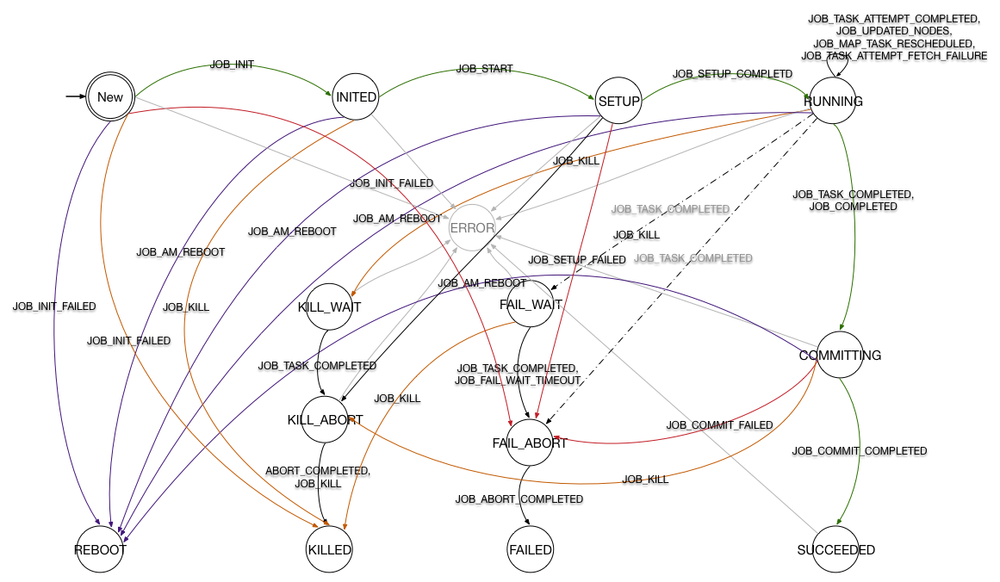

- TOC
{:toc}

# Hadoop MapReduce 状态机类结构
之前的文章[YARN 流程分析](http://frankweapon.github.io/YARN流程分析/)中提到 MR v2 之后对流程的控制都以 Actor Model 的形式进行([Actor Model (参与者模式)思想与实例](http://frankweapon.github.io/Actor_Model/))。
Hadoop MapReduce 中的状态机被封装`hadoop-mapreduce-client-app`module 的几个类中，其目录结构如下：

> org.apache.hadoop.mapreduce.v2.app.job
> event
> > JobEvent  
> > JobEventType  
> > JobFinishEvent  
> > JobStartEvent  
> > ...  

> impl  
> > JobImpl  
> > MapTaskImpl  
> > ReduceTaskImpl  
> > TaskImpl  
> > TaskAttemptImpl  

> Job  
> JobStateInternal  
> Task  
> TaskAttempt  
> TaskStateInternal  

其中 StateInternal 是一个枚举类型，其中封装了各状态机的所有状态，接口中规定了一些 get 方法，用于读取作业或任务的状态信息。
event 包中包含了这里用到的事件，正是这些事件被 handle 或 dispatch 导致了状态机变迁的发生，而变迁发生又会根据需要产生新的事件推动整个系统的进行。
impl 包中则为创建这些状态机的类，每个类中包含大量实现`SingleArcTransition`或`MultipleArcTransition`接口的内部类，这些内部类分别代表着一个变迁。
接口中只规定了一个方法
``` java
  public STATE transition(OPERAND operand, EVENT event);
```
任何变迁都要实现这个方法，保证在接收到某事件后可做出一系列操作并进入下一状态。
状态机类都包含一个静态变量*stateMachineFactory*用于将状态与变迁连接到一起，形成状态机。
`StateMachineFactory`是 YARN 中一个不可变类，用*final*修饰，它提供了一个方法*addTransition()*
```java
  public StateMachineFactory
             <OPERAND, STATE, EVENTTYPE, EVENT>
          addTransition(STATE preState, STATE postState,
                        EVENTTYPE eventType,
                        SingleArcTransition<OPERAND, EVENT> hook){
    return new StateMachineFactory<OPERAND, STATE, EVENTTYPE, EVENT>
        (this, new ApplicableSingleOrMultipleTransition<OPERAND, STATE, EVENTTYPE, EVENT>
           (preState, eventType, new SingleInternalArc(postState, hook)));
  }
```
可以看出，这个方法采用链式编程的原则，所以在初始化*stateMachineFactory*的时候，可以不断调用该方法向状态机中加入新的变迁。
该方法另有4个重载方法，其一与之类似，将后置状态改为一个Set，SingleArcTransition 改为 multipleArcTransition，用于根据事件中的具体情况判断变迁如何进行。
另两个取消 hook 参数，用于添加可忽略的事件，最后一个重载方法将返回一个新的状态机。
所有变迁添加完成后调用*installTopology()*完成状态机的创建。
# 状态机及变迁分析
因官方提供下载的 FSM 并没有随着版本更新，在下面我对 Hadoop 2.7.3 中的状态机进行了绘制。下图中考虑到可见性有部分省略，需要确认变迁请参照上章节内容到源代码中查看。
图中绿色线代表正常流程，红色线代表失效，黄色线代表关闭。
虚线表现了一部分 multipleArcTransition，也就是在收到某事件时，将进一步判断事件内部信息来决定状态机变迁如何产生。
驱动整个状态机的入口在*handle()*方法中，首先将写操作上锁，然后获取当前状态，然后执行*doTransition()*。在该方法中捕获到`InvalidStateTransitionException`时，
首先更新状态，然后生成`InternalError`事件，状态机计入`Error`状态。
## JobImpl
### 状态机
JobImpl 中创建的状态机如下图所示，为了清晰度省略了一部分变迁。

Hadoop提供了作业级别的容错能力，图中紫色线将重启作业，而灰色线则代表发生`InternalError`时进入`Error`状态。
### 变迁(待填坑)

## TaskImpl
### 状态机

### 变迁(待填坑)

## TaskAttemptImpl
### 状态机

### 变迁(待填坑)
