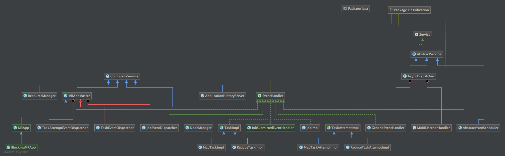

- TOC
{:toc}

# Hadoop中的事件总线
之前的文章[Hadoop状态机介绍](http://frankweapon.github.io/Hadoop-MapReduce状态机分析/)提到整个Hadoop的调度由状态机来控制，而驱动状态机变迁的则是事件。
这里给出Hadoop中几个类的层级结构图，内容较多，该图可由Intellij idea导出。

从图中我们可以看到，实现`AbstractService`类有三种，其一为`CompositeService`，它的子类包括了之前提到的RM，NM以及AM等，这些子类都有*main()*方法，也就是说，在运行Hadoop的过程中，他们各自独立为一个进程；
其二为`AbstractYarnScheduler`，这个类完全属于YARN模块内，这里不进行介绍。最后一个则是所有事件的总线，`AsyncDispatcher`。Hadoop运行过程中所有的事件都将被发布到该类的一个阻塞队列当中，再由他做一次分发。
在这个类中有几个重要的内容：
- **eventDispatchers**: Map类型的成员变量，其Key为eventType，是一个枚举类型，value为处理该eventType的`EventHandler`。关于`EventHandler`，我们从图中可以看到，大量的类都实现了该接口，
其中既包括`TaskImpl`这样封装了状态机的类，也包括`JobEventDispatcher`这样只做分发并不做其他处理的分发器类。其实Dispatch这样的操作本身也属于处理事件的一种方式，起名为Dispatcher更能表达该类本身的行为。
所有实现`EventHandler`的类通过*`AsyncDispatcher:`register()*将自身注册到**eventDispatchers**之中。
- **GenericEventHandler**: 他是一个内部类，实现了`EventHandler`，在*handle()*方法中把收到的时间put到eventQueue中。
- **dispatch()**: *dispatch()*方法从队列中拿一个事件，到*eventDispatchers*中寻找对应的handler，调用其*handle()*方法。这里值得注意的是，在这个方法中捕获到异常时，他会新开启一个shutdownThread关闭`AsyncDispatcher`服务。

在开发过程中，我们可能需要对事件处理部分进行断点调试，在这个类中加断点将阻塞所有消息，包括RM以及NM本身运行所发的事件。所以更好的方式是找到与开发内容相关的事件分发器，避免`AsyncDispatcher`中的大量事件的干扰。
# MRAppMaster中的事件处理
<!--当Job由用户编写后通过JobClient提交，在YARN上会启用实现了`ClientProtocal`的`YARNRunner`。在该类中通过`ResourceMgrDelegate`-->
之前提到 MRAppMaster 作为一个单独的进程，有它的main方法。在main方法中除了设置一系列相关参数以及关闭时使用的钩子函数外，调用了静态方法*initAndStartAppMaster()*。在这个方法中进行用户身份的验证等操作，最后以用户身份初始化并运行 MRAppMaster。

从之前的层次结构图中可以看到，MRAppMaster也是`AbstractService`的实现类，他重写了*serviceInit(final Configuration conf)*方法，首先根据入参*conf*设置了一系列上下文环境以及成员变量，然后调用*createDispatcher()*实例化了一个`AsyncDispatcher`。
但是，在这里并没有单例模式出现，同时在ResourceManager 等AbstractService 的子类中也有这样的实例化方法。这与我所设想的有些不同，如果按照代码中所示，将有多个`AsyncDispatcher`的实例出现，而且其中的消息队列以及存储handler与对应事件的Map也不是静态变量。
也就意味着在不同的服务中所使用的事件队列是不一样的，这一点需要再在运行时考证。

MRAppMaster 本身没有实现Handler接口，但他有几个实现Handler接口的内部类，在*serviceInit()*方法中调用*`AsyncDispatcher:`register*分别把他们和相关的事件进行绑定。这样一来，Job、Task、TaskAttempt 等事件就都会由对应的Handler (JobImpl,TaskImpl,TaskAttemptImpl)来进行处理。在这些实现了hanlder接口的impl内部有各自的状态机，经 MRAppMaster 分发之后的状态将驱动这些状态机进行变迁，同时不断产生新的事件直到状态机运行到终态。

